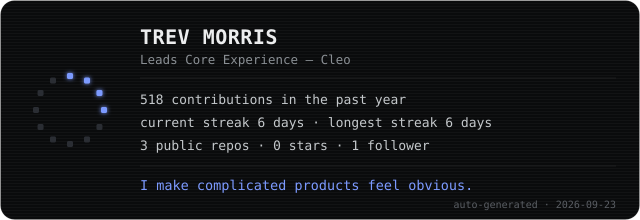

<div align="center">



<sub>the card above regenerates itself daily — see <a href="./build.js"><code>build.js</code></a></sub>

</div>

<br>

```
$ whoami
```

I lead Core Experience at Cleo, its first Staff Product Designer, and built the
governance and contribution model behind the app's information architecture and
its design system, Cleonardo. Before that: Tandem Bank, the LEGO Group, BBC, ITV,
MTV, Burberry, TalkTalk, Yale University Press and Radioplayer.

Most interface problems turn out to be structural, so that's usually where I
start — though sometimes the fix isn't solving the problem, it's changing how
it's perceived.

```
$ cat now-building.md
```

I write a lot more code these days, with AI as the pair: personal projects,
Figma plugins for the team, and production work at Cleo that goes through
engineering review like anything else. It has changed how I design — closer to
the material, fewer handoffs, and a faster answer to the only question that
matters: did it actually work.

```
$ ls side-projects/
```

| | | |
|---|---|---|
| ⏱ | [**Time Dissonance**](https://time-dissonance.vercel.app/) | a small clock experiment |
| ✍️ | [**Design4Lyf**](https://eye-for-type-rjm3.ooda.run/) | typography, for the love of it |
| 🌙 | [**The Daily Ritual**](https://the-daily-ritual-woad.vercel.app/) | a quiet daily-habit tracker |
| 🎄 | [**Brookwood Hunt**](https://brookwood-hunt.vercel.app/) | a Christmas scavenger hunt for the street |

```
$ open designedbytrev.vercel.app
```

More of this — case studies, the design-systems work, the rest of it — lives at
**[designedbytrev.vercel.app](https://designedbytrev.vercel.app/)**.

<br>

<div align="center">

📬 **[designbytrev@gmail.com](mailto:designbytrev@gmail.com)** · [LinkedIn](https://www.linkedin.com/in/trevmorris/)

</div>
